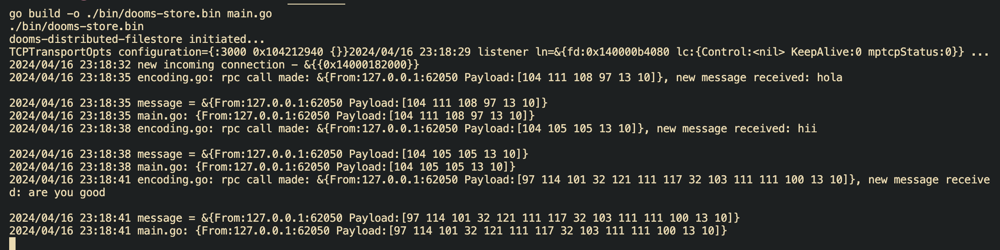

# Dooms Distributed Filestore

vol: 1.49.25
Note: This project is in building stage currently!

Dooms Filestore - is an implementation of distributed filestore system. Which works and supports multiple `Transport` networking layers (OSI-5) methods like TCP, UDP, Sockets, GRPC etc. currently.

## Project structure

- `transport` - contains all the library implementation of the dooms transport requirements.

## Iterative Updates

- Support for transport message:
  

- OnPeer Close() accidentaly (Node failure case)
  

- Testing CAS FilePath Function
  

## Project setup

- To run the project locally

  ```bash
  go mod tidy
  make test
  make run
  ```

- Run inside Docker container:

  ```bash
  make run-container
  ```
